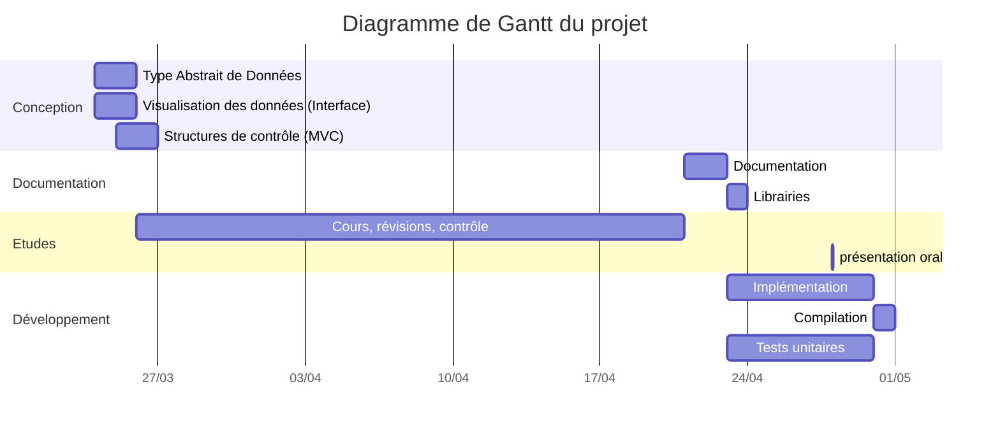

*[TAD]: Type Abstrait de Données
*[BAC]: Book A Classroom
*[MVC]: Modèle Vue Contrôleur

"Book A Classroom", un gestionnaire de réservation de salles d'universités
===

*Par MIHAJA RAZAFIMAHEFA et Ambre ROUZADE*

[TOC]

# Introduction

BAC est un projet réalisé durant notre année universitaire L2 CUPGE en Structure de données.
Écrite en C et compilée avec Makefile, BAC permet de consulter l'emploi du temps et gérer les réservations de différentes formations, réparties dans différentes salles pour différents enseignements à un horaire donnée.

# Organisation du travail

Avant de passer au codage, nous nous sommes d'abord réunis pour décomposer le projet, notamment la modélisation du problème. Nous avons donc passé 1 semaine à réfléchir ensemble aux différentes structures de données utiles, leurs opérations et comment les articuler pour obtenir le résultat souhaité. Nous avons constitué les TAD (une version préliminaire est disponible dans le fichier TAD.md) et imaginé l’interface.

Le travail se décompose ainsi en 5 phases :

- Phase d'organisation : Répartition des tâches, Configuration des outils de collaborations, définitions des objectifs
- Phase de conception : Définition de l'architecture du programme, des TAD, de l'interface utilisateur
- Phase de documentation : Mise en place de l'organigramme du projet, des en-têtes, des tests unitaires, familiarisation avec les librairies externes
- Phase d'implémentation : Définitions des méthodes et des structures, algorithmiques
- Phase de tests et de compilation : Passation des tests unitaires ou des tests utilisateurs grandeurs natures.



## Répartition du travail

Nous nous sommes répartis le travail en fonction de nos préférences mais nous avons toujours regardé ce que faisait l’autre et mis en commun.
Mihaja s’est occupé de la recherche des librairies, des tests unitaires et de l'interface. Tandis que Ambre s’est concentré sur les modules des structures.

Nous avons mis en place un [repertoire github](https://github.com/rmihaja/BAC) pour se partager nos avancées et nous avons créé des branches (devMihaja et devAmbre) pour ne pas faire de merge conflict. Pour faire la mise en commun de notre travail, nous effectuons un merge sur la branche feature, tout cela afin de nous permettre de coder sans s’empiéter.

# Organisation du programme

De manière général, nous conseillons vivement de lire la documentation Doxygen pour obtenir la spécification complète du programme.

## Compilation

Le programme est compilé à partir d'un Makefile principal : celui se trouvant à la racine du projet. Il va tout d'abord compiler les librairies externes, suivi des librairies du programme organisées en modules, dont les commandes se trouve dans des sous-Makefile, dans le dossier de chaque module. Puis il va compiler le programme principale main.

## Structure

Le projet respecte l'architecte MVC. C'est-à-dire que le programme est découpé en 3 modules distincts :

### Model

Model est le module qui contient la majeure partie des structures de données du programme. Il est donc l'implémentation des TAD et regroupe les opérations élémentaires de manipulation de nos données. Elle respecte aussi le paradigme de la programmation orientée objet, c'est-à-dire que les structures (et leurs manipulations) se rapproche au plus de la manipulation d'objets.

Voici la liste des structures de données que compose modele :

```txt
 model
 ┣ creneau.c
 ┣ enseignant.c
 ┣ enseignants.c
 ┣ enseignements.c
 ┣ formation.c
 ┣ formations.c
 ┣ horaire.c
 ┣ salle.c
 ┗ salles.c
```

Il y a notamment 2 grands groupes de structures : les objets et les collections.

#### Les structures objets

Les structures objets avec leurs attributs regroupent :

- Enseignant : défini par un nom et une matière
- Horaire : défini par un début et une fin
- Creneau : défini par un horaire, un enseignant, le nom d'une formation et d'une salle. C'est le coeur de notre projet.

Ce sont les structures primaires du programme, stockant notamment les attributs qui les représente. Les fonctions types associés à ces structures respectent pour la plupart une même syntaxe :

- `{nom de l'objet}` : constructeur par défaut de l'objet, avec des attributs initialisés mais vides.
- `...Copie` : permet de copier les attributs en paramètre dans un nouvel objet.
- `...Parser` : constructeur de l'objet à partir de sa représentation JSON (voir la librairie utilisée [Jansson](https://jansson.readthedocs.io/)).
- `getJson...` : permet d'obtenir la représentation JSON de l'objet
- `get...` : permet d'obtenir un attribut de l'objet.
- `set...` : permet de définir un attribut de l'objet.
- `equals...` : permet de comparer deux objets de même type afin de savoir s'ils ont les mêmes attributs.
- `affiche...` : permet d'imprimer sur stdout une représentation externe visualisable de l'objet.
- `toString...` : permet d'obtenir la représentation JSON de l'objet, mais dans sa version en chaîne de caractère.

#### Les structures collections

Les structures collections englobent :

- Enseignants : défini par une liste chaînée de Enseignant
- Enseignements : défini une liste chaînée de chaîne de caractère définissant un Enseignement
- Salles : défini par une liste chaînée de Salle
- Formation : défini par un nom et un tableau de Creneau (limité à 4)
- Formations : défini par un tableau de Formation (limité à 3)
- Salle : défini par un nom et un tableau de 24 Creneau (représentant un jour)

Ces structures respectent toujours à peu près la même définition qu'un objet, à la seule différence qu'il est ou possède un ensemble d'autres objets, ce qui les détachent de la propriété primaire des objets. Elles nécessitent notamment une référence des objets primaires à la compilation (pour les tests unitaires).

Outre les fonctions définit pour un objet, les collections possèdent aussi d'autres méthodes spécifiques à la manipulation d'ensembles, qui respecte à peu près la même syntaxe :

> **Note :**
> Nous définissons par `{a}` un attribut d'un objet.

- `get...By{a}` : permet d'obtenir un élément de la liste à partir de son attribut
- `get...ByIndice` :  permet d'obtenir un élément de la liste à partir de son indice dans la liste
- `size...` : permet d'obtenir la taille de l'ensemble
- `appartient...` : permet de savoir si un élément appartient déjà à l'ensemble
- `ajouter...` : permet de rajouter une référence de l'objet à l'ensemble
- `supprimer...` : permet de supprimer la référence de l'objet de l'ensemble

> **Note :**
> Pour une liste complète et détaillée des fonctions du programme, veuillez vous référer à la documentation intégrée du projet, obtenu avec Doxygen.

### View

View est le module permettant de gérer les entrées utilisateurs ainsi que l'interaction Homme-Machine. Elle permet notamment d'afficher des messages, de prendre le choix de l'utilisateur ainsi que ses entrées. Il n'englobe qu'une seule structure de données : entree.

Elle possède des macros permettant de formatter l'impression sur stdout :

- `println` : imprime une chaîne de caractère suivi de 2 retours à ligne
- `display` : imprime une chaîne de caractère selon un format (comme printf) suivi de 2 retours à la ligne

Le macro `BUFFER_SIZE` pour gérer l'allocation mémoire d'une entrée. Si l'utilisateur imprime plus de BUFFER_SIZE caractères, le module va automatiquement s'arrêter à la 256ème caractères pour avoir une chaîne valide. Ce comportement est suivi par `getCharInput`.

Pour une description détaillée des fonctions, se référer à Doxygen.

### Control

Control est le module qui met le lien entre Model et View en gérant l'affichage à l'utilisateur. Il ne possède qu'une seule structure : controle, mais qui possède des "panneaux" afin de définir l'affichage courant (appelé état) de l'application en fonction du choix de l'utilisateur. Cela est géré par un gestionnaire des choix, `afficherPanneauSuivant`, qui s'exécute dans une boucle : `run`.

#### Fonctionnement de l'affichage : Gestion de Panneaux

Un panneau est un état structuré de l'affichage qui présente de manière ordonnée les entrées/sorties (les fonctions `affiche...`) afin de répondre à une action de l'utilisateur (exemple réserver un créneau ou afficher une salle) et modifier le modele.

Tous panneaux de Controle commencent par `afficherPanneau...` et renvoie un entier qui permet à l'utilisateur de communiquer avec le gestionnaire des choix afin qu'il puisse le rediriger vers le bon panneau qui suit.

Les échanges suivent notamment le traitement suivant :

- `0` permet de sortir de la boucle `run` et marque la fin du programme.
- `1, 2, ...` permet de naviguer vers d'autres panneaux à partir d'un état courant.
- `-1` demande explicitement à revenir à l'état précédant s'il le permet, en annulant l'opération en cours.

L'état courant de l'affichage est codifié à partir d'un enum (plus d'informations sur chaque enum est disponible sur Doxygen). La boucle procède alors comme suit :

0. L'état 0 (initialisation) consiste à afficher le panneau Bienvenue.
1. Le panneau Bienvenue demande un choix à l'utilisateur et le renvoie.
2. La boucle lit ce choix et s'arrête si elle vaut `0`.
3. Sinon, le choix et l'état courant (BIENVENUE) est envoyé au gestionnaire des choix.
4. Le gestionnaire des choix lit le choix et l'état courant, puis le modifie pour stocker l'enum de l'état suivant (exemple CONNEXION), il renvoie alors la fonction responsable d'afficher ce panneau et poursuit.
5. on affiche le panneau renvoyé et on recommence...

Nous avons ainsi une gestion dynamique de notre interface.

Pour chaque panneau effectuant une modification des données, il est à noter que l'utilisateur se trouvera dans une boucle tant que ses entrées ne sont pas valides. Ainsi, les échanges suivent le traitement suivant :

- `1` permet de rester dans la boucle afin de tenter une autre modification. À chaque fois que l'utilisateur présente une entrée fausse, il lui sera présenter le choix de réessayer (qui renverra donc `1`) ou quitter.
- `0` permet de quitter explicitement la boucle et l'application.
- `-1` permet de quitter explicitement la boucle et revenir en arrière.
- `2, 3, ...` permet donc de valider l'entrée utilisateur et continuer le cycle de l'application.

Même si le gestionnaire de choix ne prendra pas en compte la valeur de retour différent de zéro pour un panneau de modification, notons que nous pouvons tracer le choix de l'utilisateur par :

- `1` si l'utilisateur a bien effectué des changements, et que ces changements sont valides et validées.
- `-1` si l'utilisateur a explicitement annulé l'opération de modification.

#### Stockage des données

À la sortie de l'application, le programme sauvegarde systématiquement les données des structures dans un fichier `data.json` à l'aide de l'API Jansson.
Par défaut, le fichier se trouvera dans `./bin/data`

##### Encryption

Pour encrypter notre mot de passe, nous avons utilisé l'algorithme ROT13.

> **Note :**
> Si le mot de passe a été oublié, supprimer le fichier `./bin/data/data.json` permet de le réinitialiser à sa valeur par défaut "mdp".

# Mode d'emploi du programme

Il y a 2 profils différents pour utiliser le logiciel :

- administrateur qui permet de modifier, ajouter et supprimer des cours (créneaux).
- client qui permet de consulter les emplois du temps par enseignant, par salle, par formation.

Voici l'affichage présenté à l'utilisateur au lancement du programme :

```txt
******************************
*     Bienvenue dans BAC     *
******************************

1) Se connecter en tant que client
2) Se connecter en tant qu'administrateur

0) Quitter

Votre choix : _
```

## Profil client

Nous pouvons ici consulter un emploi du temps. Dans chaque menu ou visuel il y a la possibilité de revenir en arrière (ou quitter).

### Consulter un emploi du temps

#### Par salle

On utilisera les fonctions de Salles et Salle notamment `afficheSalles` qui permet d’afficher comme ceci :
C’est un peu l’emploi du temps global.

```txt
-----------------
EDT de la Salle : 3TP2
-----------------

de 8h00 à 9h00
VIDE

de 9h00 à 10h00
VIDE

// ...

de 15h00 à 16h00
COUTIN Laure
Mathématiques
CUPGE Physique

de 16h00 à 17h00
COUTIN Laure
Mathématiques
CUPGE Physique

// ...
```

//

#### Par formation

Pour afficher l’emploi du temps par enseignant on parcourt chaque salle (qui stocke les informations importantes) et affiche les créneaux qui correspondent à la formation voulue.

```txt
---------------------
EDT de la formation : CUPGE Chimie
---------------------

---------------------
EDT de la formation : CUPGE Informatique
---------------------

Salle 106
de 8h00 à 10h00
Structure de données
PHILIPPE Truillet

---------------------
EDT de la formation : CUPGE Physique
---------------------

Salle 3TP2
de 15h00 à 17h00
Mathématiques
COUTIN Laure
```

#### Par Enseignant

Pour afficher l’emploi du temps par enseignant on parcourt chaque salle (qui stocke les informations importantes) et affiche les créneaux qui correspondent à l’enseignant voulu.

```txt
---------------------
EDT de l'Enseignant : PHILIPPE Truillet
---------------------

Salle 106
De 8h00 à 10h00
Structure de données, CUPGE Informatique

---------------------
EDT de l'Enseignant : GAILDRAT Véronique
---------------------

...
```

### Mode administrateur

Le mode administrateur se modèle d’une toute autre manière.

#### Authentification

Nous devons sécuriser l’accès à la modification des données. Pour cela nous avons mis en place une « session » qui demande un mot de passe.

```txt
************ Panneau de contrôle administrateur ************

Veuillez vous connecter pour continuer

Mot de passe : _
```

> **Note :**
> Le mot de passe par défaut est "mdp".

Si le mot de passe est incorrect, nous pouvons réessayer ou quitter :

```txt
Mot de passe : test
Mot de passe incorrect.

1) Réessayer

0) Quitter

Votre choix : _
```

Si le mot de passe est correct, nous serons connecté en mode administrateur avec un panneau de gestion comme suit :

```txt
Vous êtes connecté en tant que : Administrateur

1) Gestion des enseignants
2) Gestion des enseignements
3) Gestion des salles
4) Gestion des réservations
5) Changer le mot de passe

0) Quitter

Votre choix : _
```

Pour chaque option, nous serons présenté avec les différentes actions disponibles spécifiées par les contraintes de programmation :

1. Gestion des enseignants : ajouter, modifier ou supprimer un enseignant, afficher la liste des enseignants
2. Gestion des enseignements : ajouter, modifier ou supprimer un enseignement, afficher la liste des enseignements par heure
3. Gestion des salles : ajouter, modifier une salle, afficher la liste des salles par étage
4. Gestion des réservations : réserver une salle pour un enseignement, annuler une réservation, modifier une réservation, afficher la liste des salles réservées par formation
5. Administration : changer le mot de passe

# Bilan

## Difficultés

Nous avons eu quelques difficultés au début du projet concernant la vision de la modélisation. En effet, nous avions tous les 2 réfléchi à des manières différentes d’implémenter et d’imbriquer les différentes tâches. Suite à certaines réflexions et discussions nous sommes arrivés à des compromis.

Nous avons aussi eu des difficultés concernant le temps de travail. En effet, nous avons eu du mal à faire coïncider l’avancement du projet et la révision des partiels.

La gestion des librairies externes a aussi été dure. C'est la première qu'on avait le droit d'en utiliser et c'est vrai qu'intégrer du code externe devient une contrainte à la compilation, où la nécessité de l'installer au dépend de l'utilisateur se révèle important.

## Point de vue personnel

Ce projet que nous avons adoré faire nous a apporté de nouvelles connaissances ou de l’approfondissement concernant GitHub et le C.
Nous avons aussi pu réutiliser nos connaissances théoriques et expérimenter à nouveau les modules, et aussi à écouter l’avis de l’autre et travailler en groupe.
Nous retiendrons que prévoir ses tâches et le temps pour les réaliser est très important afin de privilégier certaines ou se réorganiser.

## Améliorations et perspective pour la suite

Nous prévoyons d'utiliser [Doxybook](https://github.com/matusnovak/doxybook2) si possible afin de rendre l'interface Doxygen plus belle et agréable en utilisant un frontend plus moderne.

Par manque de temps, nous n'avons pas pu utiliser `openssl` pour l'encryption de nos données.
