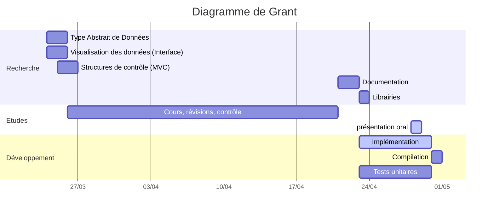

---
presentation:
    theme: beige.css
    progress: false
    enableSpeakerNotes: true
export_on_save:
    puppeteer: true
---

<!-- slide -->

# Book A Classroom

par RAZAFIMAHEFA Mihaja et ROUZADE Ambre

**Structure de données**

<!-- slide -->

## Comment on a procédé ?

<!-- slide -->



<!-- slide -->
## Répartition du travail
| Mihaja | Ambre |
| ------ | ----- |
| Librairies | Structure de données |
| Compilation | En-tête |
| Tests unitaires | Interface utilisateur |
| Documentation | |

<!-- slide -->
## Librairies et outils utilisé

- Github (pour le stockage)

https://github.com/rmihaja/BAC

<!-- TODO ajouter github -->

- Visual Studio Code (IDE)

Librairies externes :

- `tests.h` de Yannick Chevalier (revisité) pour les Tests Unitaires
- `jansson.h` pour la manipulation JSON
- `openssl.h` pour l'encryption

<!-- slide -->
## Quelles sont les structures de données définis ?

- types singuliers
- collections

<!-- slide -->
### Enseignant

$$
    \begin{align*}
        \operatorname{enseignant} \colon \Sigma^\star \times \Sigma^\star & \longrightarrow E \\
        (nom, matiere) & \longmapsto \operatorname{enseignant}(nom, matiere)
    \end{align*}
$$

<!-- slide -->
### Enseignants

$$
    \operatorname{enseignants} \colon \empty \longrightarrow E^\N
$$

- Sorte : $E^\N \coloneqq \text{liste chaînée d'enseignants}$
- Utilise : $E, \Sigma^\star$

<!-- slide -->
### Horaire

$$
    \begin{align*}
        \operatorname{horaire} \colon \llbracket 8, 18 \rrbracket \times \llbracket 9, 20 \rrbracket & \longrightarrow H \\
        (debut, fin) & \longmapsto \operatorname{horaire}(debut, fin)
    \end{align*}
$$

<!-- slide -->
### Créneau

$$
    \begin{align*}
        \operatorname{creneau} \colon E \times H \times \Sigma^\star \times \Sigma^\star & \longrightarrow C \\
        (enseignant, horaire, formation, salle) & \longmapsto \operatorname{creneau}(enseignant, horaire, formation, salle)
    \end{align*}
$$

<!-- slide -->
### Salle

$$
    \begin{align*}
        \operatorname{salle} \colon \Sigma^\star & \longrightarrow S \\
        nom & \longmapsto \operatorname{salle}(nom)
    \end{align*}
$$

<!-- slide -->
### Salles

$$
    \operatorname{salles} \colon \empty \longrightarrow S^\N
$$

- Sorte : $S^\N \coloneqq \text{liste chaînée de salles}$
- Utilise : $S, \N$

<!-- slide -->
### Formation

$$
    \begin{align*}
        \operatorname{formation} \colon \Sigma^\star & \longrightarrow F \\
        nom & \longmapsto \operatorname{formation}(nom)
    \end{align*}
$$

- Sorte : $F$
- Utilise : $C^\N \coloneqq \text{tableau de créneau}, H, \Sigma^\star, \mathbb{B}$

<!-- slide -->
### Contrôle

$$
    \operatorname{controle} \colon \empty \longrightarrow \mathcal{C}
$$

- Sorte : $\mathcal{C}$
- Utilise : $E^\N, S^\N, F^\N, \Sigma^\star, \mathbb{B}$

<!-- slide -->
#### Opérateur de contrôle

- $\operatorname{reserverCreneau} \colon \mathcal{C} \times C \longrightarrow \mathcal{C}$
- $\operatorname{annulerCreneau} \colon \mathcal{C} \times C \longrightarrow \mathcal{C}$
- $\operatorname{modifierCreneau} \colon \mathcal{C} \times C \longrightarrow \mathcal{C}$
- $\operatorname{enregistrerJson} \colon \mathcal{C} \times \mathrm{File*} \longrightarrow  \mathrm{File*}$
- $\operatorname{afficherEnseignants}$
- $\operatorname{afficherEDTFormation}$
- $\operatorname{afficherEDTEnseignants}$
- $\operatorname{afficherEDTSalle}$

<!-- slide -->

```json
{
    "enseignants": [
        {
            "nom": "TRUILLET"
            "matière": "Structure de données"
        },
        // ...
    ],
    "salles": [
        {
            "nom": "108"
            "creneaux":
            {
                "formation": "CUPGE",
                "salle": "108",
                "horaire" : {
                    "debut": 8,
                    "fin": 9
                },
                "enseignants": // { ... }
            }
        }
    ],
    "formation": // { ... }

}
```

<!-- slide -->

## Interface utilisateur

<!-- slide -->
### Lancement de l'application

```text
*********************
* Bienvenue sur BAC *
*********************

Vous êtes connecté en tant que : Visiteur

1) Informations
2) Se connecter en tant qu'administrateur

Votre choix : _
```

<!-- slide -->

### Panneau visiteur (choix 1)

```text
1) Consulter l'emploi du temps
2) Consulter la liste des enseignants

Votre choix : _
```

<!-- slide -->
### Consulter l'emploi du temps (par salle)

```text
-----------
Salle : 108
-----------

de 8h00 à 9h00
COUTIN, Mathématiques
L2 Mathématiques

-----------
Salle : 112
-----------

de 13h00 à 15h00
TRUILLET, Structure de données
CUPGE

// ...

1) Quitter

Votre choix : _
```

<!-- slide -->
### Consulter la liste des enseignants

```text
OLIVIER, Électromagnétisme
COUTIN, Mathématiques
GAILDRAT, Programmation orientée object
TRUILLET, Structure de données

1) Quitter

Votre choix : _
```

<!-- slide -->
### Se connecter en tant qu'administrateur

```txt
Mot de passe : _
```

```txt
MAUVAIS MOT DE PASSE

1) Réessayer
2) Quitter

Votre choix : _

```

<!-- slide -->
### Panel de l'administrateur

```txt
1) réserver un nouveau créneau
2) modifier un créneau
3) Quitter

Emploi du temps par salle :

-----------
Salle : 108
-----------

de 8h00 à 9h00
COUTIN, Mathématiques
CUPGE

de 10h00 à 12h00
GAILDRAT, Programmation orientée object
L2 Informatique

// ...

Votre choix : _
```

<!-- slide -->
### Réserver un nouveau créneau

```txt
0) Créer un nouveau enseignant

Ou sélectionner le numéro d'un enseignant selon l'ordre ci-dessous :

OLIVIER, Électromagnétisme
COUTIN, Mathématiques
GAILDRAT, Programmation orientée object
TRUILLET, Structure de données

Votre choix : _
```

### Créer le nouveau créneau

```txt
Enseignant sélectionné : OLIVIER
Sélectionnez une formation :

CUPGE
L2 Informatique
L3 Informatique

Votre choix : _
```

<!-- slide -->

```txt
Enseignant sélectionné : OLIVIER
Formation sélectionnée : CUPGE

Saisir un horaire (entre 8 et 20).

Votre choix : _
```

// ...

<!-- slide -->

## Difficultés et perspective pour la suite

